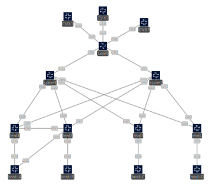

# VXLAN CVX Lab

This lab provides a foundational understanding of Virtual Extensible LAN (VXLAN) technology along with MLAG for access layer redundancy and CloudVision eXchange (CVX) VXLAN Control Service (VCS) for VXLAN Control plane.

---
## Topology

The network topology for this lab is shown below. You can also open the `images/vxlan-cvx.svg` file with most modern web browsers or any SVG-compatible image viewer for a closer look.

---
## Prerequisites

*(Optional: Add any prerequisites for the lab here, e.g., software, prior knowledge)*

---
## Lab Objectives

*(Optional: List what the user will learn or achieve in this lab)*

---
## Steps

*(Optional: Outline the steps or exercises for the lab)*

---
## Notes

*(Optional: Add any additional notes or important information)*